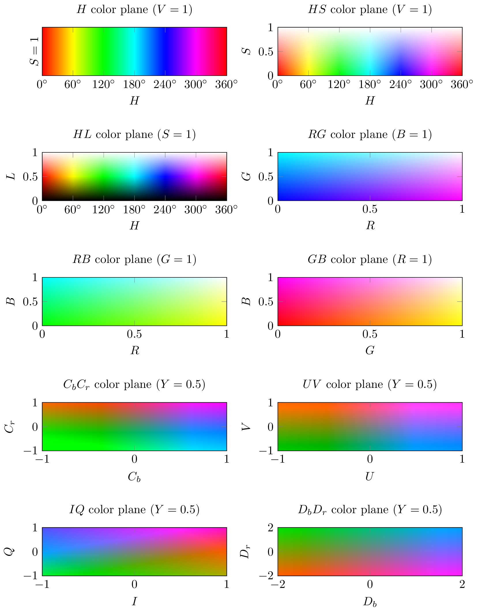

# Visualization of 2-D Color Space Planes using TikZ

This repository provides a small TikZ/PGF library that allows to visualize 2-D
planes of various color spaces, e.g., RGB, HSV, HSL.

## Getting Started

In your preamble, load the library:

```tex
\usetikzlibrary{colorplanes}
```

You can then access the color planes by name using the `/tikz/shading` key,
e.g.,:

```tex
\shade [shading=H plane] (0,0) rectangle (1,2);
```

Supported color planes are:

* `DbDr plane`
* `GB plane`
* `H plane`
* `HL plane`
* `HS plane`
* `IQ plane`
* `RB plane`
* `RG plane`
* `UV plane`

## Example



## License

The library is licensed under the [LPPL](https://www.latex-project.org/lppl).
